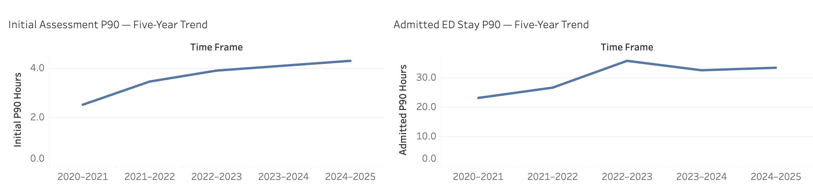
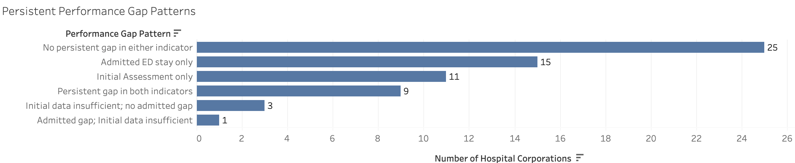
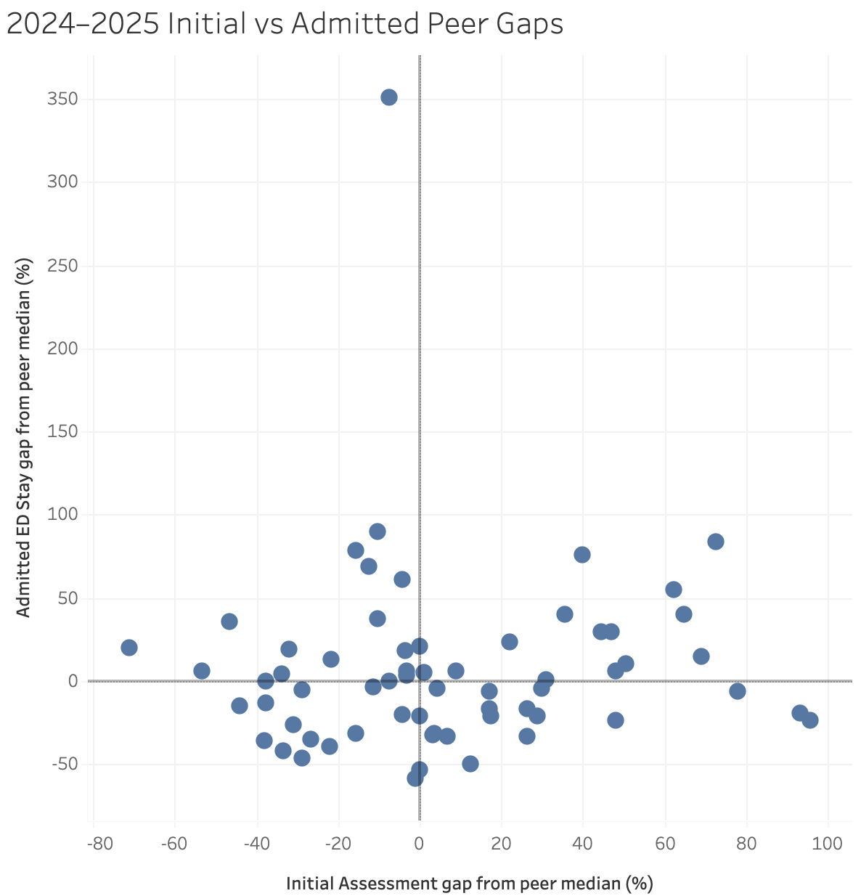
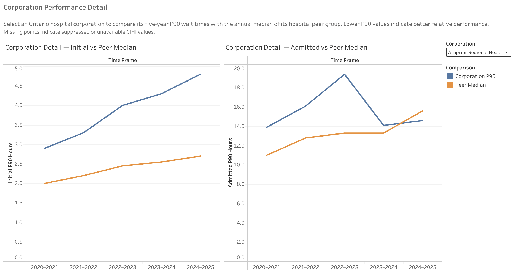
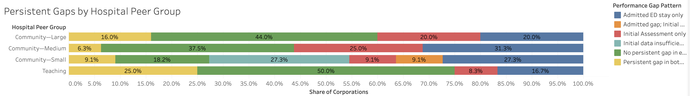
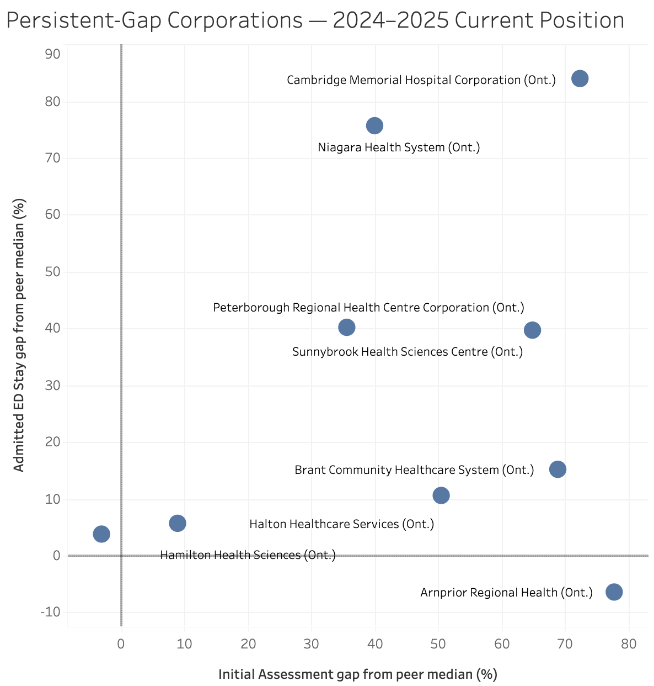

# Ontario Emergency Department Performance Analysis

A five-year analysis of emergency department wait times across Ontario hospital corporations using public data from the Canadian Institute for Health Information (CIHI).

## Project Overview

Emergency department performance can look very different depending on which part of the patient journey is being measured. In this project, I looked at two CIHI indicators:

- Physician Initial Assessment wait time
- Total ED time for patients who were admitted

I wanted to see how these measures changed over time, how hospital corporations compared with similar hospitals, and whether some performance gaps appeared repeatedly across several years.

## Interactive Dashboard

View the interactive Tableau dashboard https://public.tableau.com/views/OntarioEmergencyDepartmentPerformanceAnalysis/OntarioEDPerformanceOverview?:language=en-US&:sid=&:redirect=auth&:display_count=n&:origin=viz_share_link

## Main Analytical Question

Which Ontario hospital corporations show persistent emergency department performance gaps, and do those gaps appear mainly before initial physician assessment, later in the ED stay for admitted patients, or in both stages?

## Analytical Approach

CIHI already reports both indicators, along with hospital peer groups and its own performance comparison and trend measures.

For this case study, I used the published indicator values to build a separate longitudinal comparison at the Ontario hospital corporation level. I:

- compared each corporation with the annual median of its hospital peer group;
- measured the size of the gap from that peer benchmark;
- looked for gaps that persisted across multiple fiscal years;
- compared the two ED indicators to see where those persistent gaps appeared.

The peer-median benchmark and persistent-gap definition used here are analytical methods created for this project and are separate from CIHI's official performance comparison methodology.

## Question 1

### How did emergency department wait times change across Ontario hospital corporations over the five-year period?

### Finding

At the corporation level, the median P90 wait for initial physician assessment increased from **2.5 hours in 2020–2021 to 4.3 hours in 2024–2025**.

For admitted patients, the pattern was different. The median P90 ED stay increased from **23.0 hours in 2020–2021 to 35.6 hours in 2022–2023**, then declined somewhat over the next two years to about **33.3 hours in 2024–2025**.

*Five-year median P90 trends for initial physician assessment and admitted-patient ED stay.*

### Insight

Both measures ended the five-year period higher than where they started, but they followed different paths.

Initial assessment waits increased fairly steadily. Admitted-patient ED stay rose much more sharply through 2022–2023, then showed some improvement afterward.

Seeing the two measures side by side made it clear that the pattern was not the same across different stages of the ED visit.

### Recommendation

The continued increase in initial-assessment wait times is worth looking at more closely because it appears across several years rather than in a single period.

The improvement in admitted-patient ED stay after 2022–2023 is also worth following to see whether it continues in future years.

## Question 2

### Did the same hospital corporations remain above their peer-group median over time?

### Finding

The five-year classification showed several different patterns across the 64 Ontario hospital corporations:

- **25** did not show a persistent gap in either measure.
- **15** showed a persistent gap only in admitted-patient ED stay.
- **11** showed a persistent gap only in initial physician assessment.
- **9** showed persistent gaps in both measures.
- **4** could not be fully classified for initial assessment because of suppressed values; among them, **1** still showed a persistent gap in admitted-patient ED stay.

*Five-year persistent-gap patterns across 64 Ontario hospital corporations.*

### Insight

Persistent gaps did not follow one common pattern.

Some corporations were repeatedly above their peer median before initial physician assessment, while others showed the gap mainly in admitted-patient ED stay. Nine corporations showed persistent gaps in both measures.

This means that looking at only one ED indicator would not have shown the full picture for every corporation.

### Recommendation

Corporations with persistent gaps in both measures are a useful starting point for deeper review because the pattern appears at more than one stage of the ED visit.

Corporations with a gap in only one measure should be reviewed separately, since the part of the patient journey that stands out is different.

To understand what may be contributing to these gaps, the wait-time results would need to be combined with operational information such as patient volumes, case mix, staffing, and inpatient capacity.

## Question 3

### How much did 2024–2025 performance vary between hospital corporations when compared with their own peer group?

### Finding

The 2024–2025 results showed large differences between Ontario hospital corporations relative to their peer-group median.

For both indicators, some corporations had P90 wait times below their peer median, while others were well above it. The spread was especially noticeable for admitted-patient ED stay.

One of the clearest examples was Haliburton Highlands Health Services. Its admitted-patient P90 was **70.3 hours**, compared with a peer-group median of **15.6 hours**, a gap of about **350.6%**.

*2024–2025 corporation-level gaps relative to hospital peer-group medians. Each point represents one Ontario hospital corporation.*[View this chart interactively in Tableau Public](https://public.tableau.com/views/OntarioEmergencyDepartmentPerformanceAnalysis/20242025InitialvsAdmittedPeerGaps?:language=en-US&:sid=&:redirect=auth&:display_count=n&:origin=viz_share_link)

### Insight

The Ontario-wide trend does not show how much performance varies from one corporation to another.

Even within the same hospital peer group, some corporations were much closer to the median than others. Looking at the gap from the peer median gave more context than comparing raw wait times alone.

This also showed why one provincial number cannot describe the performance of every hospital corporation.

### Recommendation

Large positive gaps are worth flagging for closer review, especially when the same corporation also shows a persistent gap over several years.
These results should be treated as a starting point for further investigation, not as a ranking of hospital performance.

## Question 4

### Does a corporation's 2024–2025 performance tell the same story as its five-year pattern?

### Finding

Not always.

The latest-year result gives a useful snapshot, but it does not always match the longer-term pattern.

Among the nine corporations with persistent gaps in both indicators, seven were still above their peer median in both measures in 2024–2025. Two showed a mixed latest-year result.

Hamilton Health Sciences was slightly below its peer median for initial assessment but remained above it for admitted-patient ED stay. Arnprior Regional Health showed the opposite pattern: initial assessment remained above the peer median, while admitted-patient ED stay moved below it.

  

*Five-year P90 trends for Arnprior Regional Health compared with annual peer-group medians for initial assessment and admitted-patient ED stay.*
[Explore corporation-level trends in Tableau Public](https://public.tableau.com/views/OntarioEmergencyDepartmentPerformanceAnalysis/CorporationPerformanceDetail?:language=en-US&:sid=&:redirect=auth&:display_count=n&:origin=viz_share_link)

### Insight

A single year can tell a different story from the five-year pattern.

Looking only at 2024–2025 could make a recent change look like a long-standing issue. Looking only at the five-year classification could also hide a recent improvement or deterioration.

Using both views together gives more context: the latest year shows where a corporation stands now, while the persistent-gap classification shows whether that pattern has been repeated over time.

### Recommendation

Current-year results and longer-term patterns should be reviewed together.

When the latest-year result differs from the historical pattern, additional years of data would help show whether the change is continuing or is only temporary.

However, a large gap should be treated as a signal for further investigation rather than a conclusion about why a corporation is performing differently.

## Question 5
### Were persistent performance gaps concentrated in particular hospital peer groups?

### Finding
Persistent performance gaps appeared across all four hospital peer groups rather than being concentrated in one type of hospital.

Community–Medium had the highest share of corporations with a confirmed persistent gap in at least one indicator, with **10 of 16 corporations (62.5%)**. This was followed by Community–Large at **14 of 25 (56.0%)** and Teaching hospitals at **6 of 12 (50.0%)**.

Community–Small hospitals also showed persistent gaps, although several corporations in this group had suppressed initial-assessment values, making the comparison less complete.

The type of gap also varied by peer group. For example, **3 of 12 Teaching corporations (25.0%)** had persistent gaps in both indicators, compared with **1 of 16 Community–Medium corporations (6.3%)**.

*Distribution of five-year persistent-gap patterns within each Ontario hospital peer group.*[View this chart interactively in Tableau Public](https://public.tableau.com/views/OntarioEmergencyDepartmentPerformanceAnalysis/PersistentGapsbyHospitalPeerGroup?:language=en-US&:sid=&:redirect=auth&:display_count=n&:origin=viz_share_link)

### Insight
There was no single hospital peer group where persistent ED performance gaps were overwhelmingly concentrated.

Although Community–Medium had the highest proportion, persistent gaps were still common across the other peer groups. What stood out more was that the type of gap differed between groups. Some had more corporations with a gap in only one part of the ED journey, while Teaching hospitals had a relatively larger share with persistent gaps in both indicators.

### Recommendation
Peer group provides useful context when comparing hospital corporations, but it should not be used on its own to explain persistent performance gaps.

A useful next step would be to examine corporations with persistent gaps within each peer group alongside operational information such as patient volume, case mix, staffing, and inpatient capacity.

For Community–Small hospitals, suppressed initial-assessment values should also be considered before making broader comparisons with the other peer groups.

## Question 6

### Which hospital corporations stand out for further investigation when long-term and current performance are considered together?

### Finding

Nine hospital corporations showed persistent gaps in both ED indicators over the five-year period.

When I compared those corporations with their 2024–2025 peer-group benchmarks, **7 of the 9 were still above their peer median in both indicators**.

Two corporations showed a more mixed current-year pattern. Hamilton Health Sciences was slightly below its peer median for initial assessment but remained above it for admitted-patient ED stay. Arnprior Regional Health showed the opposite pattern: initial assessment remained above the peer median, while admitted-patient ED stay was below it.

Some of the largest current gaps within this persistent-gap group were seen at Cambridge Memorial Hospital, Niagara Health System, and Peterborough Regional Health Centre.

*2024–2025 peer-group gaps for the nine hospital corporations with persistent gaps in both ED indicators over the five-year period.*[Explore this view interactively in Tableau Public](https://public.tableau.com/views/OntarioEmergencyDepartmentPerformanceAnalysis/CurrentPerformanceofPersistent-GapCorporations?:language=en-US&:sid=&:redirect=auth&:display_count=n&:origin=viz_share_link)

### Insight

For most corporations with persistent gaps in both indicators, the longer-term pattern was still visible in the most recent year.

The seven corporations that remained above their peer median in both measures are useful starting points for further review. At the same time, Hamilton Health Sciences and Arnprior Regional Health show why the latest year should not simply be treated as a continuation of the historical pattern.

### Recommendation

Corporations that combine a five-year persistent gap with above-peer **wait times** in both indicators in 2024–2025 would be reasonable priorities for a closer operational review.

The purpose of that review would be to understand what may be contributing to the pattern, not to assume a cause from the wait-time data alone. Patient volume, case mix, staffing, inpatient capacity, and other operational measures would be needed before drawing conclusions.

Corporations whose latest-year results have moved away from their historical pattern should also be followed over additional years to see whether the change continues.

## Limitations

This analysis is based on publicly reported CIHI data and is intended to identify patterns in ED wait-time performance, not to explain why those patterns occurred.

A few limitations are important when interpreting the results:

- The analysis uses corporation-level P90 wait times. It does not include patient-level records, so differences in patient acuity, case mix, or individual patient experience could not be examined.

- The peer-group benchmark is based on the median corporation within each hospital peer group. It is not volume-weighted, so a smaller and a larger corporation each contribute equally to the benchmark.

- Some physician initial-assessment values were suppressed by CIHI. These values were kept as unavailable rather than estimated, which means that a small number of corporations could not be fully classified for persistent initial-assessment gaps.

- The datasets do not include operational factors such as staffing levels, ED visit volumes, inpatient bed availability, or local capacity constraints. For that reason, the analysis cannot determine what caused a corporation to perform above or below its peer benchmark.

- The persistent-gap definition used in this project — being above the annual peer-group median in at least 4 of 5 years — is an analytical rule created for this analysis. It is not CIHI's official performance classification.

- The study covers five fiscal years, from 2020–2021 to 2024–2025. Recent changes may therefore need additional years of data before they can be considered a sustained improvement or deterioration.

## Final Recommendations

Based on the patterns identified in this analysis, a few areas would be worth prioritizing for further review:

- **Focus first on corporations with persistent gaps in both indicators.**  
  These organizations showed repeated above-peer wait times across both initial physician assessment and admitted-patient ED stay, making them the clearest candidates for deeper operational investigation.

- **Consider current performance together with the five-year pattern.**  
  A single year can look better or worse than the longer-term trend. Corporations that remain above their peer median in 2024–2025 after showing persistent gaps over several years deserve particular attention, while recent improvements should be followed to see whether they continue.

- **Investigate the two stages of the ED journey separately.**  
  Some corporations showed persistent gaps only in initial assessment, while others showed gaps mainly in admitted-patient ED stay. These patterns should not automatically be treated as the same type of performance issue.

- **Keep peer-group context in the comparison.**  
  Persistent gaps were present across all hospital peer groups, so hospital type alone does not explain the differences. Comparing corporations with similar peers remains more informative than using a single Ontario-wide benchmark.

- **Combine wait-time results with operational data before making decisions.**  
  Patient volumes, case mix, staffing, inpatient bed availability, and other capacity measures would help determine what may be contributing to the gaps identified here.

These recommendations are intended to identify where further investigation may be useful. The wait-time data alone is not enough to determine the underlying cause of a corporation's performance.

## Conclusion

This analysis showed that Ontario ED performance changed over the five-year period, but the pattern was not the same across the two stages of the patient journey.

Initial physician assessment waits increased fairly steadily, while admitted-patient ED stay rose more sharply and then showed some improvement after 2022–2023. Looking at both indicators together also showed that persistent performance gaps were not limited to one type of hospital or one part of the ED visit.

The peer-group comparison helped add context to the raw wait times, and the five-year persistent-gap view made it possible to separate longer-term patterns from a single-year result.

The main value of this analysis is not to label hospitals as good or bad, but to identify where performance gaps appear repeatedly and where a closer operational review may be useful.

Further analysis using patient volume, case mix, staffing, inpatient capacity, and other operational data would be needed to understand what is driving the differences observed in this project.

